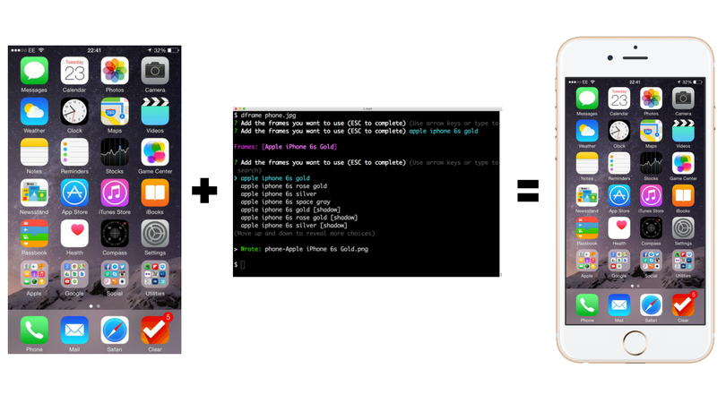
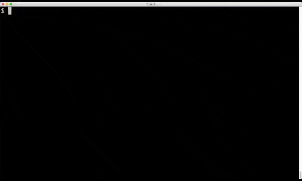
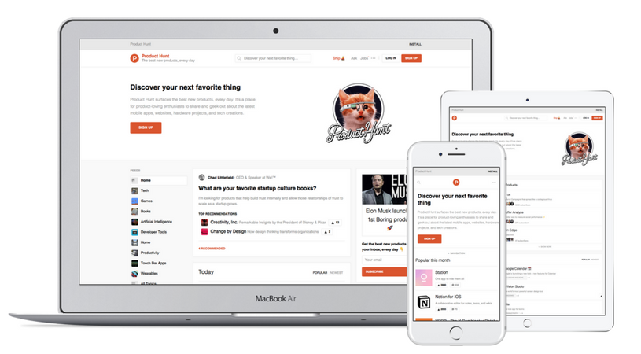

<div align="center">
  
</div>

>  Put device frames around your mobile/web/progressive app screenshots.

<div align="center">
  <strong>This tool is in active development. If something seems off, file an issue!</strong>
</div>

# Get it

    npm install -g deviceframe

# Use it

<div align="center">
  
</div>

<br>
Pass in filenames, file globs, websites urls, or image urls. In any combination or order.

```
$ dframe cat.jpg
$ dframe http://github.com
$ dframe http://github.com dog.png https://i.imgur.com/aw2bc01.jpg *.bmp
```

deviceframe will prompt you for the frames you want to use. You can select multiple frames and search by typing. Once you have selected all the frames you want to use, hit ESC.

The frames will be downloaded from a CDN and cached locally in case you want to re-use them.

If you want to use it non-interactively you can pass frames in with the `--frame flag`:

```
$ dframe cat.jpg --frame "iphone 6"
$ dframe cat.jpg --frame "iphone 7 silver" --frame "iphone 5 blue"
```

You can also use one flag and separate the devices by commas:

```
$ dframe cat.jpg --frame "iphone 6s, macbook air"
```

# Mobile Apps

_Coming Soon_

# Hybrid Apps

Make a screenshot of an Ionic app locally:

```
$ ionic serve
```

In another terminal:

```
$ dframe --delay 5 http://localhost:8100
```

# Websites

For website URLs, deviceframe will load the page with the aspect ratio and pixel density of selected device(s).

Here's Product Hunt's website on a Macbook Air, iPad, and iPhone:

<div align="center">
  
</div>

# Devices

Currently 50 unique devices. Run `dframe --devices` to get a list

* 166 phone + color combinations (Apple, Google, Samsung, HTC, Motorola)
* 6 tablets (iPad, Surface, Nexus 9)
* 9 computers (Apple, Dell, Microsoft)
* 5 monitors
* 4 watches (Apple Watch 1+2, Moto 360, Sony SmartWatch 3) either open or closed.

# Notes

* deviceframe caches frame images in a cache directory using [env-paths](https://github.com/sindresorhus/env-paths)

# Attributions

Logo icon created by Vallone Design from the Noun Project
