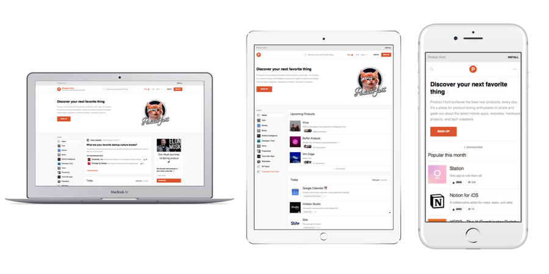

<div align="center">
  
</div>

>  Put device frames around your mobile/web/progressive app screenshots.

# Get it

    npm install -g deviceframe

# Use it

<div align="center">
  
</div>

<br>
Pass in filenames, file globs, URLs to websites or URLs to images.

```
$ dframe cat.jpg
$ dframe http://github.com
$ dframe http://githbub.com dog.png https://i.imgur.com/aw2bc01.jpg *.bmp
```

deviceframe will prompt you for the frames you want to use. You can select multiple frames and search by typing. Once you have selected all the frames you want to use, hit ESC.

# Mobile Apps


# Websites

For website URLs, deviceframe will load the page with the aspect ratio and pixel density of selected device(s).

<div align="center">
  
</div>

# Devices

* 166 phones (Apple, Google, Samsung, HTC, Motorola)
* 26 tablets (iPad, Surface, Nexus 9)
* 35 computers (Apple, Dell, Microsoft)
* 27 monitors
* 4 watches (Apple Watch 1+2, Moto 360, Sony SmartWatch 3) either open or closed.

# Notes

* deviceframe caches frame images in a cache directory using [env-paths](https://github.com/sindresorhus/env-paths)

# Attributions

Logo icon created by Vallone Design from the Noun Project
